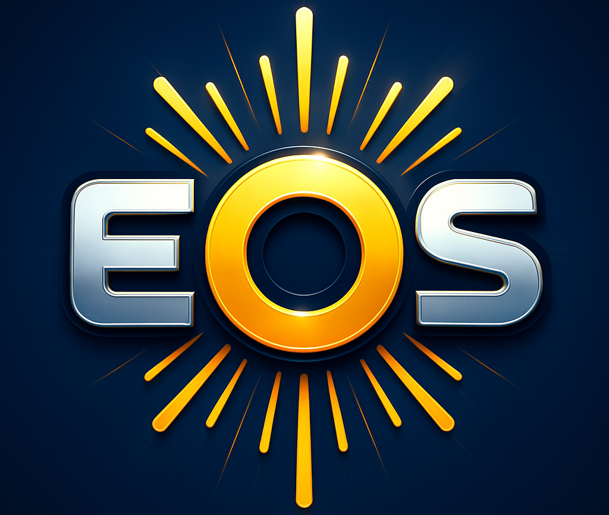

<p align="center">
    
</p>

<h1 align="center">The Experiment Orchestration System (EOS)</h1>
<h3 align="center">Foundation for laboratory automation</h3>


[](https://unc-robotics.github.io/eos/) 


EOS is a software framework and runtime for laboratory automation, designed to serve as
the foundation for one or more automated or self-driving labs (SDLs).

**Core**
* Plugin system for defining labs, devices, tasks, experiments, and optimizers
* Package system for sharing and reusing automation code
* Validation of experiments, parameters, and configurations at load time and runtime

**Execution & Scheduling**
* Central orchestrator that coordinates devices and experiments across multiple computers
* Intelligent task scheduling with dynamic device and resource allocation
* Scheduling simulation for testing strategies offline without hardware

**Optimization**
* Built-in Bayesian optimization for experiment campaigns, with single and multi-objective support
* Hybrid AI-Bayesian optimizer that combines Bayesian optimization with LLM reasoning

**Interfaces**
* Web UI with visual experiment editor, real-time monitoring, device inspector, and file browser
* REST API with OpenAPI documentation
* MCP server for connecting AI assistants
* SiLA 2 instrument protocol integration

Documentation is available at [https://unc-robotics.github.io/eos/](https://unc-robotics.github.io/eos/).

## Installation

EOS should be installed on a central laboratory computer that is easily accessible.

EOS requires PostgreSQL and S3-compatible object storage (SeaweedFS by default) for data and file storage. These can be 
run with Docker Compose.

1. **Install uv**
   - **Linux/Mac**
     ```shell
     curl -LsSf https://astral.sh/uv/install.sh | sh
     ```
   - **Windows**
     ```shell
     powershell -ExecutionPolicy ByPass -c "irm https://astral.sh/uv/install.ps1 | iex"
     ```

2. **Install EOS**
   ```shell
   git clone https://github.com/UNC-Robotics/eos
   cd eos
   uv venv
   source .venv/bin/activate
   uv sync --all-groups
   ```

3. **Configure EOS**
   ```shell
   cp .env.example .env
   cp config.example.yml config.yml
   ```

   Edit both `.env` and `config.yml` and provide values for missing fields

4. **Launch External Services**
   ```shell
   docker compose up -d
   ```

5. **Start EOS**
   ```shell
   eos start
   ```

6. **Configure the Web UI** (in a new terminal)
   ```shell
   cd web_ui
   cp .env.prod.example .env.prod
   # Edit .env.prod and provide values
   ```

7. **Build and Launch Web UI**
   ```shell
   docker compose up -d
   ```

## Citation
If you use EOS for your work, please cite:
```bibtex
@inproceedings{Angelopoulos2025_EOS,
  title = {The {{Experiment Orchestration System}} ({{EOS}}): {{Comprehensive Foundation}} for {{Laboratory Automation}}},
  shorttitle = {The {{Experiment Orchestration System}} ({{EOS}})},
  booktitle = {2025 {{IEEE International Conference}} on {{Robotics}} and {{Automation}} ({{ICRA}})},
  author = {Angelopoulos, Angelos and Baykal, Cem and Kandel, Jade and Verber, Matthew and Cahoon, James F. and Alterovitz, Ron},
  year = {2025},
  month = may,
  pages = {15900--15906},
  doi = {10.1109/ICRA55743.2025.11128578},
}
```
