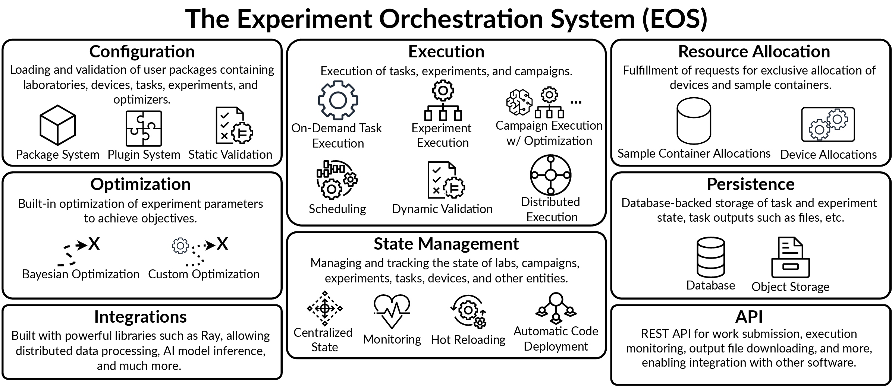

The Experiment Orchestration System (EOS)
=========================================

EOS is a software framework and runtime for laboratory automation, designed
to serve as the foundation for one or more automated or self-driving labs (SDLs).

**Core**

* Plugin system for defining labs, devices, tasks, experiments, and optimizers
* Package system for sharing and reusing automation code
* Validation of experiments, parameters, and configurations at load time and runtime

**Execution & Scheduling**

* Central orchestrator that coordinates devices and experiments across multiple computers
* Intelligent task scheduling with dynamic device and resource allocation
* Scheduling simulation for testing strategies offline without hardware

**Optimization**

* Built-in Bayesian optimization for experiment campaigns, with single and multi-objective support
* Hybrid AI-Bayesian optimizer that combines Bayesian optimization with LLM reasoning

**Interfaces**

* Web UI with visual experiment editor, real-time monitoring, device inspector, and file browser
* REST API with OpenAPI documentation
* MCP server for connecting AI assistants
* SiLA 2 instrument protocol integration

.. toctree::
   :caption: User Guide
   :maxdepth: 2

   user-guide/index
