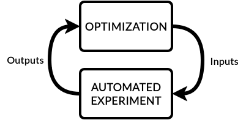

Optimizers
==========
Optimizers are key to building an autonomous laboratory.
In EOS, optimizers give intelligence to campaigns by optimizing task parameters to achieve objectives over time.
EOS optimizers are *sequential*, meaning they iteratively optimize parameters by drawing on previous protocol runs.
**Bayesian optimization** is one of the most common sequential methods, especially useful for expensive-to-evaluate black-box functions.

EOS has a built-in Bayesian optimizer powered by `BoFire <https://experimental-design.github.io/bofire/>`_
(based on `BoTorch <https://botorch.org/>`_).
This optimizer supports both constrained single-objective and multi-objective Bayesian optimization.
It offers several different surrogate models, including Gaussian Processes (GPs) and Multi-Layer Perceptrons (MLPs),
along with various acquisition functions.

Distributed Execution
---------------------
EOS optimizers run in a dedicated Ray actor process, which can be placed on any machine with an active Ray worker.
This allows the optimizer to run on a more capable machine than the one hosting the EOS orchestrator.

Optimizer Implementation
------------------------
EOS optimizers are defined in the ``optimizer.py`` file adjacent to ``protocol.yml`` in an EOS package.
Below is an example:

:bdg-primary:`optimizer.py`

.. code-block:: python

    from bofire.data_models.acquisition_functions.acquisition_function import qUCB
    from bofire.data_models.enum import SamplingMethodEnum
    from bofire.data_models.features.continuous import ContinuousOutput, ContinuousInput
    from bofire.data_models.objectives.identity import MinimizeObjective

    from eos.optimization.sequential_bayesian_optimizer import BayesianSequentialOptimizer
    from eos.optimization.abstract_sequential_optimizer import AbstractSequentialOptimizer

    def eos_create_campaign_optimizer() -> tuple[dict, type[AbstractSequentialOptimizer]]:
        constructor_args = {
            "inputs": [
                ContinuousInput(key="mix_colors.cyan_volume", bounds=(0, 25)),
                ContinuousInput(key="mix_colors.cyan_strength", bounds=(2, 100)),
                ContinuousInput(key="mix_colors.magenta_volume", bounds=(0, 25)),
                ContinuousInput(key="mix_colors.magenta_strength", bounds=(2, 100)),
                ContinuousInput(key="mix_colors.yellow_volume", bounds=(0, 25)),
                ContinuousInput(key="mix_colors.yellow_strength", bounds=(2, 100)),
                ContinuousInput(key="mix_colors.black_volume", bounds=(0, 25)),
                ContinuousInput(key="mix_colors.black_strength", bounds=(2, 100)),
                ContinuousInput(key="mix_colors.mixing_time", bounds=(1, 45)),
                ContinuousInput(key="mix_colors.mixing_speed", bounds=(100, 200)),
            ],
            "outputs": [
                ContinuousOutput(key="score_color.loss", objective=MinimizeObjective(w=1.0)),
            ],
            "constraints": [],
            "acquisition_function": qUCB(beta=1),
            "num_initial_samples": 10,
            "initial_sampling_method": SamplingMethodEnum.SOBOL,
        }

        return constructor_args, BayesianSequentialOptimizer

Each ``optimizer.py`` must contain ``eos_create_campaign_optimizer``, which returns:

#. The constructor arguments for an optimizer class instance
#. The optimizer class type

This example uses EOS' built-in Bayesian optimizer.

For most use cases, the :doc:`beacon_optimizer` is recommended. It combines Bayesian optimization with AI-driven reasoning for faster convergence, using the same domain definition (inputs, outputs, constraints) but adding an AI agent that reasons about protocol run history to suggest smarter parameter sets.

Custom optimizers can also be defined in this file; just return their constructor arguments and class type from ``eos_create_campaign_optimizer``.

.. note::
    All optimizers must inherit from the class ``AbstractSequentialOptimizer`` under the ``eos.optimization`` module.

Input and Output Parameter Naming
"""""""""""""""""""""""""""""""""
Input and output parameter names must reference task parameters using the EOS reference format:

**TASK.PARAMETER_NAME**

This lets EOS associate the optimizer with protocol tasks and forward parameter values correctly.

Example Custom Optimizer
------------------------
Below is a custom optimizer that randomly samples parameters for the same color mixing problem:

:bdg-primary:`optimizer.py`

.. code-block:: python

    import random
    from dataclasses import dataclass
    from enum import Enum
    import pandas as pd

    from eos.optimization.abstract_sequential_optimizer import AbstractSequentialOptimizer

    class ObjectiveType(Enum):
        MINIMIZE = 1
        MAXIMIZE = 2

    @dataclass
    class Parameter:
        name: str
        lower_bound: float
        upper_bound: float

    @dataclass
    class Metric:
        name: str
        objective: ObjectiveType

    class RandomSamplingOptimizer(AbstractSequentialOptimizer):
        def __init__(self, parameters: list[Parameter], metrics: list[Metric]):
            self.parameters = parameters
            self.metrics = metrics
            self.results: list[dict] = []

        def sample(self, num_protocol_runs: int = 1) -> pd.DataFrame:
            samples = []
            for _ in range(num_protocol_runs):
                sample = {p.name: random.uniform(p.lower_bound, p.upper_bound) for p in self.parameters}
                samples.append(sample)
            return pd.DataFrame(samples)

        def report(self, inputs_df: pd.DataFrame, outputs_df: pd.DataFrame) -> None:
            for _, row in pd.concat([inputs_df, outputs_df], axis=1).iterrows():
                self.results.append(row.to_dict())

        def get_optimal_solutions(self) -> pd.DataFrame:
            if not self.results:
                return pd.DataFrame(
                    columns=[p.name for p in self.parameters] + [m.name for m in self.metrics]
                )
            df = pd.DataFrame(self.results)
            optimal_solutions = []
            for m in self.metrics:
                if m.objective == ObjectiveType.MINIMIZE:
                    optimal = df.loc[df[m.name].idxmin()]
                else:
                    optimal = df.loc[df[m.name].idxmax()]
                optimal_solutions.append(optimal)
            return pd.DataFrame(optimal_solutions)

        def get_input_names(self) -> list[str]:
            return [p.name for p in self.parameters]

        def get_output_names(self) -> list[str]:
            return [m.name for m in self.metrics]

        def get_num_samples_reported(self) -> int:
            return len(self.results)

    def eos_create_campaign_optimizer() -> tuple[dict, type[AbstractSequentialOptimizer]]:
        constructor_args = {
            "parameters": [
                Parameter(name="mix_colors.cyan_volume", lower_bound=0, upper_bound=25),
                Parameter(name="mix_colors.cyan_strength", lower_bound=2, upper_bound=100),
                Parameter(name="mix_colors.magenta_volume", lower_bound=0, upper_bound=25),
                Parameter(name="mix_colors.magenta_strength", lower_bound=2, upper_bound=100),
                Parameter(name="mix_colors.yellow_volume", lower_bound=0, upper_bound=25),
                Parameter(name="mix_colors.yellow_strength", lower_bound=2, upper_bound=100),
                Parameter(name="mix_colors.black_volume", lower_bound=0, upper_bound=25),
                Parameter(name="mix_colors.black_strength", lower_bound=2, upper_bound=100),
                Parameter(name="mix_colors.mixing_time", lower_bound=1, upper_bound=45),
                Parameter(name="mix_colors.mixing_speed", lower_bound=100, upper_bound=200),
            ],
            "metrics": [
                Metric(name="score_color.loss", objective=ObjectiveType.MINIMIZE),
            ],
        }
        return constructor_args, RandomSamplingOptimizer