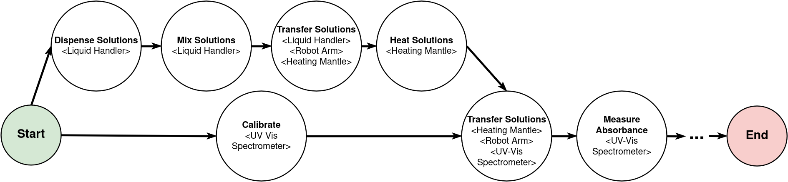

Protocols
=========
A protocol is a directed acyclic graph of tasks. Dependencies set execution order, and
:doc:`references` pass values, devices, resources, and files between tasks.

Define a Protocol
-----------------
Place ``protocol.yml`` in ``protocols/<protocol_name>/`` inside an EOS package.
Add ``optimizer.py`` only when the protocol supports :doc:`campaigns` with optimization.

This example uses the multiplication tasks from the bundled example package:

.. code-block:: yaml

    type: optimize_multiplication
    desc: Find parameters whose multiplied value is 1024
    labs: [multiplication_lab]

    tasks:
      - name: mult_1
        type: Multiplication
        devices:
          multiplier:
            lab_name: multiplication_lab
            name: multiplier
        parameters:
          number: eos_dynamic
          factor: eos_dynamic

      - name: mult_2
        type: Multiplication
        dependencies: [mult_1]
        devices:
          multiplier: mult_1.multiplier
        parameters:
          number: mult_1.product
          factor: eos_dynamic

      - name: score_multiplication
        type: Score Multiplication
        dependencies: [mult_1, mult_2]
        devices:
          analyzer:
            lab_name: multiplication_lab
            name: analyzer
        parameters:
          number: mult_1.in_number
          product: mult_2.product

``type`` identifies the protocol definition. Each execution has a separate protocol run name.
``labs`` lists the laboratories available to its tasks.

Task Fields
-----------
* ``name`` identifies the task within this protocol. ``type`` selects a task specification.
* ``dependencies`` lists tasks that must finish first.
* ``parameters`` overrides task defaults. ``eos_dynamic`` requires a value from the submission
  or optimizer before the task can run.
* ``devices`` and ``resources`` assign specific instances, request dynamic allocation, or
  reference an earlier task's allocation. See :doc:`references` and :doc:`scheduling`.
* ``files`` references earlier task output files. See :doc:`tasks`.
* ``duration`` supplies the expected execution time in seconds for scheduling.

See :doc:`color_mixing` for a larger protocol with device allocation and resource movement.

Conditionals (run_if)
~~~~~~~~~~~~~~~~~~~~~~~
Add a ``run_if`` field to a task to make it conditional.
The task runs only if the expression evaluates to ``True``, otherwise it is skipped.

.. code-block:: yaml

    - name: reanalyze
      type: Analyze Color
      run_if: score_color.loss > 0.2
      dependencies: [score_color]

Expressions reference earlier task outputs as ``task_name.output_name``.
Referenced tasks must be ancestors of the conditional task.

Supported syntax:

* Comparisons: ``==``, ``!=``, ``<``, ``<=``, ``>``, ``>=``
* Boolean operators: ``and``, ``or``, ``not``
* Literals: ints, floats, quoted strings, ``True`` / ``False``

.. code-block:: yaml

    run_if: prep.product >= 0 and prep.product <= 100
    run_if: not calibration.passed
    run_if: mode.setting == 'high' or sample.count >= 3

Expressions must return a boolean and are validated at load time.
Negative numbers are allowed. Binary arithmetic, function calls, indexing, and chained attribute access are not.

Skips propagate: a task is skipped if all of its dependencies were skipped, or (for a conditional task) if any task its
``run_if`` references was skipped.
A task with at least one non-skipped dependency still runs, enabling fan-in convergence across conditional branches.

**Branching and fan-in**: give branches complementary conditions so exactly one runs, then converge on a task depending
on both. To read the output of whichever branch ran, set a parameter to a **fan-in list** of references:

.. code-block:: yaml

    - name: measure
      type: Measure
      dependencies: []

    - name: heat
      type: Heat
      run_if: measure.temperature < 50
      dependencies: [measure]

    - name: cool
      type: Cool
      run_if: measure.temperature >= 50
      dependencies: [measure]

    - name: report
      type: Report
      dependencies: [heat, cool]
      parameters:
        reading: [heat.result, cool.result]  # fan-in: value of whichever branch ran

Each fan-in reference must point to an ancestor, and exactly one branch must run, so make the branch conditions mutually
exclusive.

Optimization
------------
Define ``eos_create_campaign_optimizer()`` in ``optimizer.py`` to return constructor arguments
and an optimizer class. See :doc:`optimizers` for the interface, :doc:`beacon_optimizer` for
hybrid optimization, and :doc:`custom_beacon` to replace Beacon's default optimizer.
