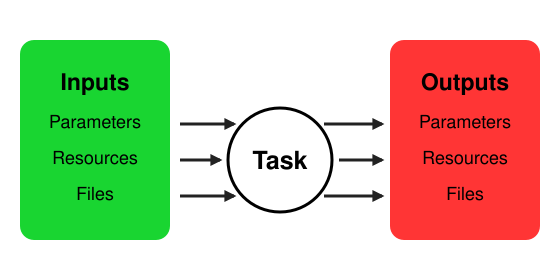

Tasks
=====
A task in EOS encapsulates an operation and can be thought of as a function.
Tasks are the elementary building block in EOS.
A task is ephemeral: created, executed, and terminated.
A task takes inputs and returns outputs, and may use one or more devices.

There are three kinds of inputs:

#. **Parameters**: Data such as integers, decimals, strings, booleans, etc that are passed to the task.
#. **Resources**: Laboratory resources such as containers (vessels that may contain samples), reagents, or other consumables.
#. **Files**: Raw data or reports produced by an earlier task, passed in as input for further processing.

There are three kinds of outputs:

#. **Parameters**: Data such as integers, decimals, strings, booleans, etc that are returned by the task.
#. **Resources**: Laboratory resources such as containers, reagents, or consumables.
#. **Files**: Raw data or reports generated by the task, such as output files from analysis.

Parameters
----------
Parameters are values input to or output from a task, each with a specific data type.
EOS supports the following parameter types:

* **int**: An int number.
  Equivalent to Python's ``int``
* **float**: A float number.
  Equivalent to Python's ``float``
* **str**: A str (series of text characters).
  Equivalent to Python's ``str``
* **bool**: A true/false value.
  Equivalent to Python's ``bool``
* **choice**: A value that must be one of a set of predefined choices.
  The choices can be any type.
* **list**: A list of values of a specific type.
  Equivalent to Python's ``list``.
* **dict**: A dict of key-value pairs.
  Equivalent to Python's ``dict``.

Tasks can have multiple parameters of different types.
EOS validates that parameters are the correct type and meet their constraints.

Resources
---------
Resources represent anything tasks must exclusively allocate (other than devices): sample containers (beakers, vials), lab locations that can only be occupied by one container, reagents, or any other asset requiring exclusive access.

Resources are referenced by a unique **resource name**, specified in the laboratory definition under the ``resources`` section.
Resources are *global* objects that can move across labs, but each must have a "home" lab from which it originates.

To pass or return a resource, its name is used (or a reference to another task's resource).
Each task accepts specific resource types such as ``beaker``, ``vial``, or custom types, and multiple resources can be passed to a single task.
Resource types are defined in the laboratory definition under ``resource_types`` and act as templates; individual instances are created under ``resources`` with a specified type.
EOS ensures only compatible resource types are passed to a task.

Files
-----
Files are raw data or reports, such as analysis output, that a task produces.
EOS stores output files so they can be downloaded by the user.
An output file can also be passed as an input to a later task for further processing.

In a protocol, an input file is supplied by pointing it at an output file of an earlier task, written as
``task_name.filename.ext``:

.. code-block:: yaml

      - name: report
        type: Report Generation
        dependencies: [ analyze ]
        files:
          raw_data: analyze.chromatogram.csv

Here the ``report`` task receives the ``chromatogram.csv`` file produced by the ``analyze`` task.

Task Implementation
-------------------
* Tasks are implemented in the `tasks` subdirectory inside an EOS package
* Each task has its own subfolder (e.g., tasks/magnetic_mixing)
* There are two key files per task: ``task.yml`` and ``task.py``

YAML File (task.yml)
~~~~~~~~~~~~~~~~~~~~
* Specifies the task type, description, devices, and input/output parameters, resources, and files
* Acts as the interface contract for the task, enforced statically and dynamically by EOS
* Serves as documentation for the task

Below is an example task YAML file for a GC analysis task using SRI Instruments GCs:

:bdg-primary:`task.yml`

.. code-block:: yaml

    type: SRI GC Analysis
    desc: Perform gas chromatography (GC) analysis on a sample.

    devices:
      gc:
        type: sri_gas_chromatograph

    input_parameters:
      analysis_time:
        type: int
        unit: seconds
        value: 480
        desc: How long to run the GC analysis

    output_parameters:
      known_substances:
        type: dict
        desc: Peaks and peak areas of identified substances
      unknown_substances:
        type: dict
        desc: Peaks and peak areas of substances that could not be identified

The task specification makes clear that:

* The task is of type "SRI GC Analysis"
* The task requires a device named ``gc`` of type ``sri_gas_chromatograph``, accessible in the implementation via ``devices["gc"]``.
* The task takes an int parameter ``analysis_time`` in seconds, with a default of 480 (optional).
* The task outputs two dictionaries: ``known_substances`` and ``unknown_substances``.

Parameter Specification
"""""""""""""""""""""""
Parameters are defined in the ``input_parameters`` and ``output_parameters`` sections of ``task.yml``.
Examples for each type:

Integer
"""""""
.. code-block:: yaml

    sample_rate:
      type: int
      desc: The number of samples per second
      value: 44100
      unit: Hz
      min: 8000
      max: 192000

Integers must have a unit (can be n/a) and optionally a minimum and maximum value.

Float
"""""
.. code-block:: yaml

    threshold_voltage:
      type: float
      desc: The voltage threshold for signal detection
      value: 2.5
      unit: volts
      min: 0.0
      max: 5.0

Floats must have a unit (can be n/a) and optionally a minimum and maximum value.

String
""""""
.. code-block:: yaml

    file_prefix:
      type: str
      desc: Prefix for output file names
      value: "protocol_run_"

Boolean
"""""""
.. code-block:: yaml

    auto_calibrate:
      type: bool
      desc: Whether to perform auto-calibration before analysis
      value: true

Choice
""""""
.. code-block:: yaml

    column_type:
      type: choice
      desc: HPLC column type
      value: "C18"
      choices:
        - "C18"
        - "C8"
        - "HILIC"
        - "Phenyl-Hexyl"
        - "Amino"

Choice parameters take one of the specified choices.

List
""""
.. code-block:: yaml

    channel_gains:
      type: list
      desc: Gain values for each input channel
      value: [1.0, 1.2, 0.8, 1.1]
      element_type: float
      length: 4
      min: [0.5, 0.5, 0.5, 0.5]
      max: [2.0, 2.0, 2.0, 2.0]

List parameters are a typed sequence with an optional fixed length and per-element min/max values.

Dictionary
""""""""""
.. code-block:: yaml

    buffer_composition:
      type: dict
      desc: Composition of a buffer solution
      value:
        pH: 7.4
        base: "Tris"
        concentration: 50
        unit: "mM"
        additives:
          NaCl: 150
          KCl: 2.7
          CaCl2: 1.0
        temperature: 25

Dictionaries are key-value pairs; values can be any type.

Parameter Groups
""""""""""""""""
Related parameters can optionally be nested under a named group for presentation purposes.
A top-level entry under ``input_parameters`` is a group when it has **no** ``type:`` field; its direct children are leaf parameter specs.

.. code-block:: yaml

    input_parameters:
      temperature:
        type: float
        unit: celsius
        value: 25.0
      wafer_parameters:
        diameter:
          type: float
          unit: mm
          value: 300.0
        thickness:
          type: float
          unit: mm
          value: 0.5

Notes:

* Grouping is purely a display concept for the visual protocol editor and submission forms. Runtime payloads, ``protocol.yml`` overrides, and task records remain flat: a submitted parameter dict is ``{diameter: 300.0}``, never ``{wafer_parameters: {diameter: 300.0}}``.
* Leaf names must be unique across all top-level leaves and groups (no two leaves named ``x`` in different groups).
* Only one level of nesting is allowed; groups cannot contain groups.
* Groups are optional; flat ``input_parameters`` continue to work unchanged.

Python File (task.py)
~~~~~~~~~~~~~~~~~~~~~~
* Implements the task
* All task implementations must inherit from ``BaseTask``

:bdg-primary:`task.py`

.. code-block:: python

    from eos.tasks.base_task import BaseTask

    class MagneticMixing(BaseTask):
        async def _execute(
            self,
            devices: BaseTask.DevicesType,
            parameters: BaseTask.ParametersType,
            resources: BaseTask.ResourcesType,
        ) -> BaseTask.OutputType:
            magnetic_mixer = devices["mixer"]
            mixing_time = parameters["mixing_time"]
            mixing_speed = parameters["mixing_speed"]

            resources["beaker"] = magnetic_mixer.mix(resources["beaker"], mixing_time, mixing_speed)

            return None, resources, None

``_execute`` is the only required method in a task implementation and accepts up to four arguments:

#. ``devices``: Devices assigned to the task, accessed by name (e.g., ``devices["mixer"]``).
   Devices are Ray actor reference wrappers; the implementation can call any function from the device implementation.
#. ``parameters``: Input parameters keyed by name.
#. ``resources``: Input resources keyed by name, as ``Resource`` objects.
#. ``files``: Input files keyed by name, each providing access to the file's contents.
