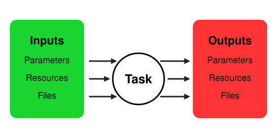

Tasks
=====
A task performs one operation, then terminates. It may call devices and exchange three kinds of data:

* **Parameters**: Typed values such as numbers, strings, and dictionaries.
* **Resources**: Exclusively allocated labware, tools, or locations.
* **Files**: Raw data or reports passed between tasks or downloaded by users.

Task Implementation
-------------------
Tasks live in the ``tasks`` directory of an EOS package. Each task has its own subdirectory
(e.g., ``tasks/magnetic_mixing``) containing a ``task.py``.

A task is an async function decorated with ``@task``. EOS derives the task specification from the function:

* The decorator argument is the task type.
* The docstring is the task description.
* Arguments are the inputs, sorted by type annotation:

  * A :doc:`device <devices>` class is a device.
  * A ``Resource`` subclass is a :doc:`resource <resources>`.
  * ``File`` is an input file.
  * ``Context`` receives the task and protocol run names.
  * Anything else is a parameter.
* The return type is a pydantic model of outputs, or ``None``.

:bdg-primary:`task.py`

.. code-block:: python

    from pydantic import BaseModel

    from eos import Param, task

    from my_package.devices.magnetic_mixer.device import MagneticMixer
    from my_package.resources import Beaker

    class MixingOutputs(BaseModel):
        mixing_time: int = Param(unit="sec", desc="How long the contents were mixed")

    @task("Magnetic Mixing")
    async def magnetic_mixing(
        mixer: MagneticMixer,
        beaker: Beaker,
        mixing_time: int = Param(60, unit="sec", min=1, max=3600, desc="Mixing duration"),
        mixing_speed: int = Param(desc="Stirring speed"),
    ) -> MixingOutputs:
        """Mix the contents of a beaker with a magnetic stirrer."""
        mixer.mix(beaker.name, mixing_time, mixing_speed)
        beaker.meta["mixed"] = True
        return MixingOutputs(mixing_time=mixing_time)

Device arguments are handles to the device processes, so calls like ``mixer.mix(...)`` run on the device.
Changes to input resources, such as ``beaker.meta``, are saved when the task completes.

Input arguments, including devices, resources, and files, can be optional with ``X | None = None``.
EOS passes ``None`` when the input is not provided.

Packages are importable Python packages named after their directory, so tasks import devices, resource
types, and shared helpers with regular imports.

Parameters
----------
EOS supports the following parameter types:

=========================  ========================================================
Annotation                 Parameter
=========================  ========================================================
``int``, ``float``         Number, with optional ``unit``, ``min``, and ``max``
``str``                    String
``bool``                   Boolean
``Literal["a", "b"]``      Choice between the listed values
``list[T]``                List of ``int``, ``float``, ``str``, or ``bool``
``tuple[T, T, T]``         Fixed-length list, passed to the task as a tuple
``dict``                   Dictionary of any values
=========================  ========================================================

A plain default makes a parameter optional. Use ``Param`` to add metadata:

.. code-block:: python

    flow_rate: float = Param(1.0, unit="mL/min", min=0.1, max=2.0, desc="Mobile phase flow rate")
    column: Literal["C18", "C8", "HILIC"] = Param("C18", desc="HPLC column")
    channel_gains: tuple[float, float] = Param((1.0, 1.2), min=(0.5, 0.5), max=(2.0, 2.0))
    carrier_gas: str = Param(desc="Carrier gas, e.g., Helium")  # required, no default

``min`` and ``max`` are inclusive. For lists, they apply per element. EOS validates supplied values against them.

Parameter Groups
~~~~~~~~~~~~~~~~
``Param(group="...")`` groups related parameters in the visual protocol editor and submission forms.
Grouping is presentational only. Protocols and submissions still refer to parameters by name, so parameter
names must be unique within a task.

Outputs
-------
Fields of the returned model are the task's outputs:

* A ``bytes`` field is an output file named after the field. ``Param(file_name="report.csv")`` sets a
  different file name.
* A ``dict[str, bytes]`` field is a set of output files whose names are only known at runtime.
* ``Path`` and ``dict[str, Path]`` fields work the same way, but the files are streamed from disk. Use them for
  large files so they are never held in memory.
* A ``Resource`` subclass field returns an updated resource, for example one returned by a device method.
* Any other field is an output parameter, using the same types as input parameters.

Optional fields such as ``bytes | None = None`` are outputs a task may skip.

Resources
---------
Annotate resource arguments with ``Resource`` subclasses that declare a resource type:

:bdg-primary:`resources.py`

.. code-block:: python

    from eos import Resource

    class Beaker(Resource, type="beaker"): ...

Protocols supply resource names or references to earlier tasks. See :doc:`resources` for type definitions
and allocation rules.

Files
-----
Files are raw data or reports, such as analysis output, that a task produces.
EOS stores output files so they can be downloaded by the user.
An output file can also be passed as an input to a later task for further processing.

In a protocol, an input file is supplied by pointing it at an output file of an earlier task, written as
``task_name.file_name``:

.. code-block:: yaml

      - name: report
        type: Report Generation
        dependencies: [ analyze ]
        files:
          raw_data: analyze.chromatogram.csv

Here the ``report`` task receives the ``chromatogram.csv`` file produced by the ``analyze`` task:

.. code-block:: python

    @task("Report Generation")
    async def report_generation(raw_data: File = Param(desc="Chromatogram data")) -> ReportOutputs:
        """Summarize a chromatogram."""
        data = await raw_data.read()
        ...

``File`` also provides ``stream()`` and ``download_to(path)`` for large files.
